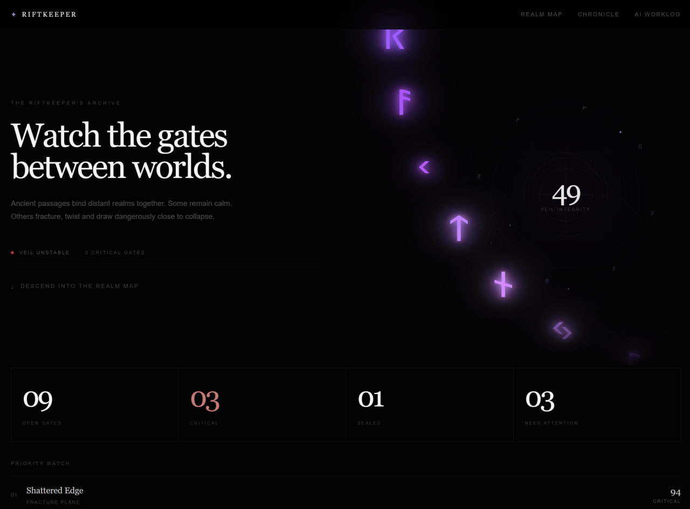
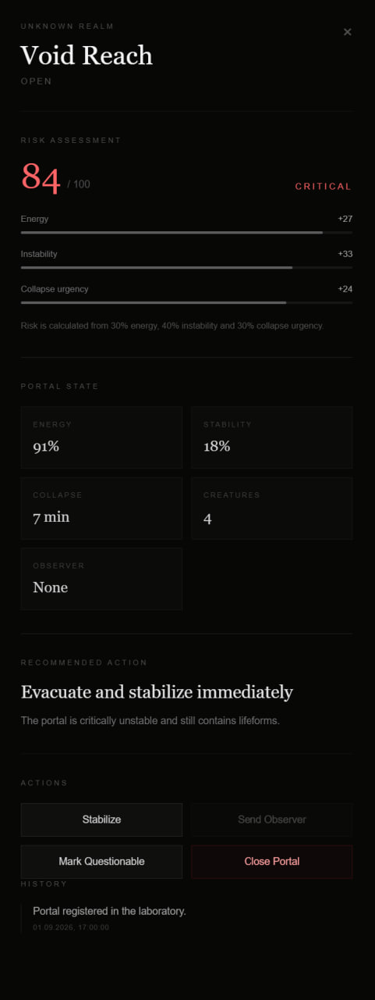
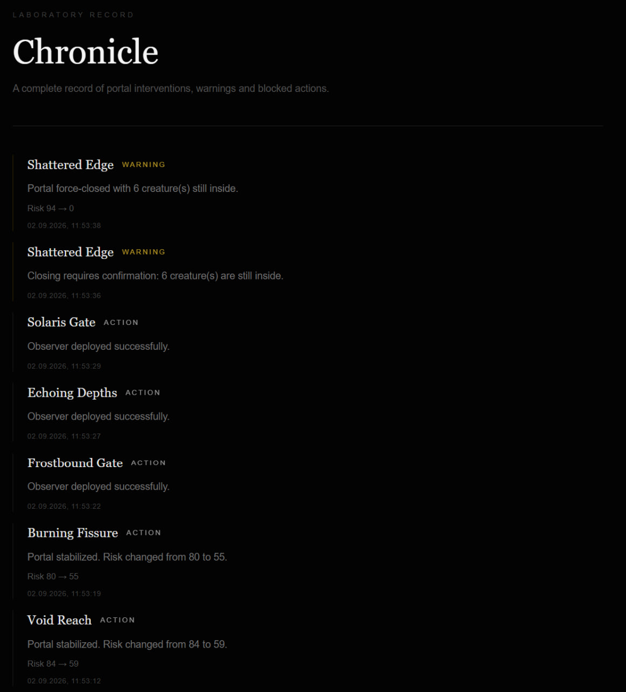
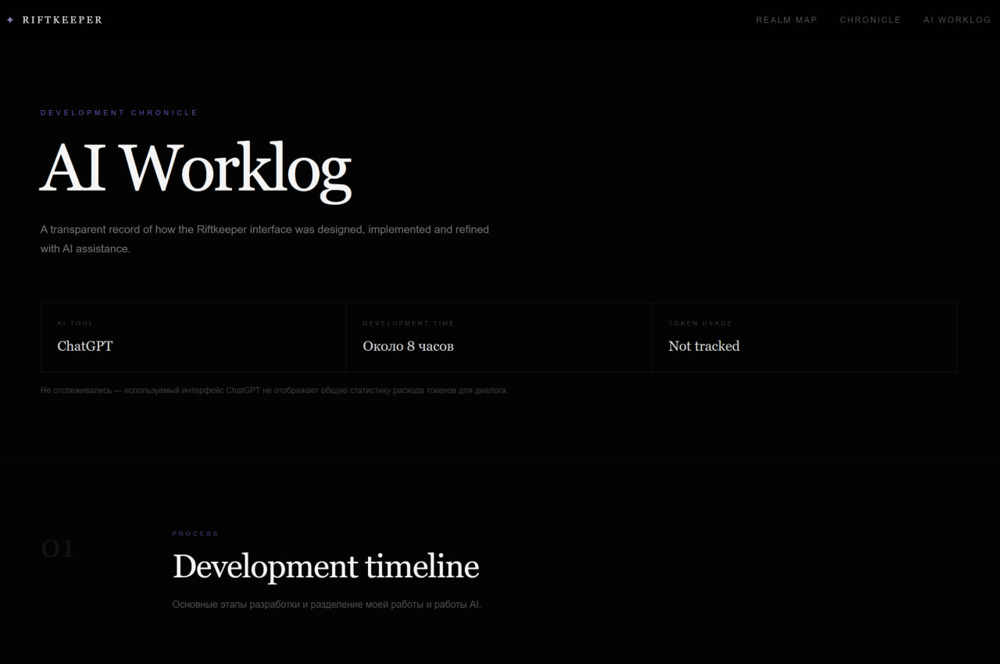

# Riftkeeper

Riftkeeper is a dark-fantasy portal monitoring interface built as a test assignment.

The application allows an operator to monitor unstable portals between worlds, calculate their risk level, perform actions, track events and inspect the current state of the laboratory through an interactive Realm Map.

## Features

- Interactive Realm Map
- Dynamic portal risk calculation
- Portal stabilization
- Portal closure
- Observer deployment
- Questionable portal marking
- Protection against invalid actions
- Portal history
- Global Chronicle / event log
- Persistent state using localStorage
- Laboratory reset
- Animated CSS/SVG portal visuals
- Dynamic Veil Integrity indicator
- Built-in AI Worklog
- Automated business-logic tests

## Tech Stack

- Next.js
- React
- TypeScript
- Tailwind CSS
- Vitest
- React Context + useReducer
- localStorage
- SVG / CSS animations

## Running Locally

Clone the repository:

```bash
git clone https://github.com/asaptolya/riftkeeper.git
cd portal-lab
```

Install dependencies:

```bash
npm install
```

Start the development server:

```bash
npm run dev
```

Open:

```text
http://localhost:3000
```

## Risk Model

Portal risk is calculated dynamically instead of being stored as a separate value.

The model uses three factors:

```text
30% Energy
40% Instability
30% Collapse Urgency
```

Instability is derived from portal stability:

```text
Instability = 100 - Stability
```

The final risk value is constrained to the `0–100` range.

Risk levels:

| Risk | Level |
|---|---|
| 0–29 | Low |
| 30–59 | Moderate |
| 60–79 | High |
| 80–100 | Critical |

## Portal Actions

The application supports the following operations:

- **Stabilize** — improves portal stability and reduces its risk.
- **Close** — closes an active portal.
- **Send Observer** — deploys an observer when portal conditions allow it.
- **Mark Questionable** — marks a portal for additional attention.

Business rules are implemented separately from the UI so invalid operations are protected at the logic level rather than only through disabled buttons.

## Persistence

The project does not require authentication or shared multi-user state, so a backend was intentionally not added for the assignment scope.

Portal state and Chronicle events are persisted in `localStorage`.

A laboratory reset action restores the initial dataset for repeated testing.

## Tests

Automated tests cover the core business rules and required edge cases.

Run:

```bash
npm run test
```

Current result:

```text
Test Files  2 passed
Tests       6 passed
```

Covered scenarios include:

- Critical portal risk calculation
- Risk constrained between 0 and 100
- Stabilization reducing portal risk
- Closed portal stabilization protection
- Observer deployment protection for Critical portals
- Warning before closing a portal containing creatures

## AI Worklog

A complete AI Worklog is available directly inside the application through the **AI WORKLOG** section of the navigation bar.

The same worklog is included below for transparency and easier review.

### General Information

**AI tool:** ChatGPT

**Total development time:** Approximately 9 hours at the current stage.

**Token usage:** Not tracked. The ChatGPT interface used during development does not provide total token usage statistics for the conversation.

---

### 1. Requirements Analysis and Concept

**My work**

I analyzed the requirements of the assignment and determined the overall direction of the project.

Instead of building a standard administrative interface with a table, I decided to create a minimalistic dark-fantasy experience where portals are placed across a vertical Realm Map.

I also defined the main user flow and decided that a separate backend was unnecessary for the scope of the assignment.

**AI contribution**

ChatGPT was used to decompose the requirements, verify that the concept covered the mandatory scenarios, and discuss possible implementation approaches.

**Key prompt**

> "Analyze the requirements of the assignment and help me create a step-by-step development plan for a small but complete application. It should cover all required states and edge cases without unnecessary complexity."

---

### 2. Application Architecture

**My work**

I reviewed the proposed architecture and selected the final set of solutions appropriate for the scope of the assignment.

I decided not to add a backend or database because the infrastructure was unnecessary for demonstrating the required business logic.

During implementation, I continuously evaluated the proposed structure and decided which parts should remain or be changed.

**AI contribution**

ChatGPT proposed the initial architecture using Next.js and TypeScript, separate portal data models, isolated risk logic and portal actions, a global event log, React Context with `useReducer`, and `localStorage` persistence.

AI also helped separate business logic from UI so that portal rules could be tested independently.

**Key prompt**

> "Suggest an architecture for this test project that stays small while keeping business logic, state, event history and tests separated and easy to verify."

---

### 3. Risk Calculation

**My work**

I chose a simple risk formula based on the assignment requirements: high energy increases danger, low stability increases danger, and approaching collapse increases urgency.

The formula was intentionally kept simple and understandable.

```text
30% Energy
40% Instability
30% Collapse Urgency
```

**AI contribution**

ChatGPT helped move the calculation into a separate function, define the `Low / Moderate / High / Critical` levels and verify the formula against different portal states.

**Key prompt**

> "Implement this risk formula separately from the UI and create clear risk levels so that changes to portal parameters immediately recalculate the result."

---

### 4. Actions and Invalid States

**My work**

I determined how the requirements should behave in the interface and checked each scenario after implementation.

I made sure that users could not move the system into invalid states and that warnings and restrictions remained understandable.

**AI contribution**

ChatGPT helped implement `Stabilize`, `Close`, `Send Observer` and `Mark Questionable`, while keeping validation rules inside the business logic rather than only inside the UI.

AI also connected action results with portal state changes and Chronicle events.

**Key prompt**

> "Implement the actions and invalid-state restrictions from the assignment so validation stays in the business logic while the UI correctly displays restrictions and warnings."

---

### 5. UI and Visual Concept

**My work**

I defined the main visual direction of the application.

Instead of a standard dashboard, I chose a minimal black interface built around a vertical Realm Map.

During development I moved the visual direction away from sci-fi and toward dark fantasy.

I also experimented with AI-generated portal images but decided against using them. Instead, I chose to build the portals directly with CSS and SVG using animated rings, runes, glow effects, vortex animations and particles.

I later redesigned the hero section with the Veil Integrity indicator and a large animated arc of glowing runes.

**AI contribution**

ChatGPT was used to quickly implement my visual ideas in code and create CSS/SVG components and animations.

After each iteration I reviewed the result in the browser and either kept it, requested changes or rejected the implementation.

**Key prompts**

> "Create a minimal black interface where portals are positioned along a vertical path like points on a map."

> "Move away from the sci-fi direction and focus more on fantasy worlds."

> "Instead of images, create the portals with CSS/SVG using circles, moving runes, glow and energy animations."

> "Create a large arc of glowing runes that passes through only part of the hero and looks like a fragment of a huge magical mechanism outside the viewport."

---

### 6. State and Persistence

**My work**

I separately considered whether the application actually required a backend.

Because the project does not require authentication, collaboration between users or server-side persistence, I decided not to add a separate backend or database.

Local browser persistence was sufficient for the assignment.

**AI contribution**

ChatGPT helped compare storage options and suggested using `localStorage` together with React Context and `useReducer`.

AI also helped implement state restoration after page refresh and the laboratory reset functionality.

**Key prompt**

> "Do we actually need a backend here? If all requirements can be covered without one, let's use local state persistence so the application stays easier to run and review."

---

### 7. Event Chronicle

**My work**

Following the assignment requirements, I decided to place the event log in a dedicated `Chronicle` section in the navigation and checked its behavior after implementation.

**AI contribution**

ChatGPT implemented Chronicle and connected it with application state and portal actions.

**Key prompt**

> "Add the event history as a separate Chronicle page in the navbar and record portal actions there."

---

### 8. Testing

**My work**

I decided that automated tests should primarily cover the mandatory scenarios and restrictions described in the assignment.

I reviewed the tests against the requirements and ran the complete test suite myself.

All tests passed successfully on the first run.

**AI contribution**

At my request, ChatGPT wrote automated tests for the core business logic and required edge cases.

**Covered scenarios**

- Critical risk calculation
- Risk constrained to `0–100`
- Stabilization reducing portal risk
- Preventing stabilization of a closed portal
- Preventing Observer deployment into a Critical portal
- Warning before closing a portal containing creatures

**Result:** `6/6` tests passed.

**Key prompt**

> "Write tests for the business logic based on the assignment requirements. Prioritize mandatory states, risk changes and invalid actions."

---

### 9. Debugging and Iteration

**My work**

After every major change, I ran the application and inspected the result in the browser.

If something looked wrong or behaved incorrectly, I returned the component for another iteration instead of accepting the first generated result.

**AI contribution**

ChatGPT helped identify causes of errors, suggested fixes for React/Next.js and SVG animations, and reworked components based on my feedback.

**Key prompt**

> "This is how the component currently looks or behaves. Find the cause of the problem and fix it without breaking the rest of the application."

---

### 10. Final Verification

**My work**

Before publication, I ran the complete automated test suite again and created a production build of the application.

I verified that all tests passed, TypeScript completed successfully and Next.js generated all application pages without errors.

**AI contribution**

ChatGPT helped define the final technical checklist before publication.

**Result**

```text
Test Files: 2 passed
Tests:      6 passed
Production build: successful
```

**Key prompt**

> "Let's perform the final technical verification of the project before publication."

---

### Independent Decisions

#### 1. Realm Map Instead of a Standard Dashboard

Instead of a standard table or collection of cards, I decided to build the main interface as a vertical map of worlds. This preserves the required functionality while supporting the theme of the assignment.

#### 2. Dark Fantasy Instead of Sci-Fi

During development I decided to move away from sci-fi aesthetics and shift the interface toward dark fantasy while keeping the overall structure minimal.

#### 3. No Separate Demo Mode

I decided not to create a predefined demonstration scenario. Application states are produced by actual user actions, while the laboratory reset allows the initial state to be restored for repeated testing.

#### 4. No Unnecessary Backend

After reviewing the requirements, I decided to keep the application client-side. Adding a backend would increase the scope without significantly improving the scenario being evaluated.

---

### Where AI Was Wrong

#### SVG Rune Animation

ChatGPT initially implemented the SVG animation delay incorrectly, causing all runes to move at the same position. I discovered the problem during manual inspection and the animation was corrected using separate timing offsets.

#### Next.js Hydration Warning

One generated implementation produced differences between server and client rendering, causing a Next.js hydration warning. I detected the issue while running the application and the code was corrected.

#### Glow Effect Clipping

The initial implementation did not account for rune glow being clipped by the container boundaries. I noticed the visual artifact and a gradual CSS mask was added.

#### LaboratoryStatusLine Integration

During a hero redesign, ChatGPT incorrectly integrated `LaboratoryStatusLine`. A duplicate implementation caused a naming conflict, and the component was subsequently positioned incorrectly. Both problems were detected during review and corrected.

---

### Manual Refinements

I manually adjusted CSS parameters, element positioning, portal and window sizes, typography, text, colors and other visual details after inspecting the result in the browser.

Major technical rewrites were not required because the core business logic and overall code structure worked correctly.

One manual structural correction was removing the redundant `LaboratoryStatusLine` implementation after the component was reworked.

---

### Verification Process

I ran the application locally and checked the resulting interface and functionality directly in the browser.

Automated business-logic verification is described separately in the testing section.

---

### What I Would Improve in a Real Product

#### Authentication and Access Control

I would first add access-key authentication so that portal management is restricted to authorized laboratory personnel.

#### Observer Management

I would expand the Observer system with a dedicated interface showing hired observers, current shifts and availability. Operators could assign specific observers to shifts at individual portals.

#### World Map

I would add a separate map showing the planets and worlds connected by the existing portals.

#### Full Footer and Laboratory Information

I would add laboratory contact information, address, support details, phone number, email and other organizational information.

#### Partner Portals

A dedicated partner portal could be placed at the end of the Realm Map. It could display a sponsor's branding inside the portal and lead to the advertiser's website when opened.

## Screenshots

### Realm Map



### Portal Details



### Chronicle



### AI Worklog



## Future Improvements

If developed as a real product, the next steps would include access-key authentication, operator permissions, observer shift management, a map of connected worlds, laboratory contact/support information and additional portal integrations.

## Live Demo

https://riftkeeper-inky.vercel.app/
